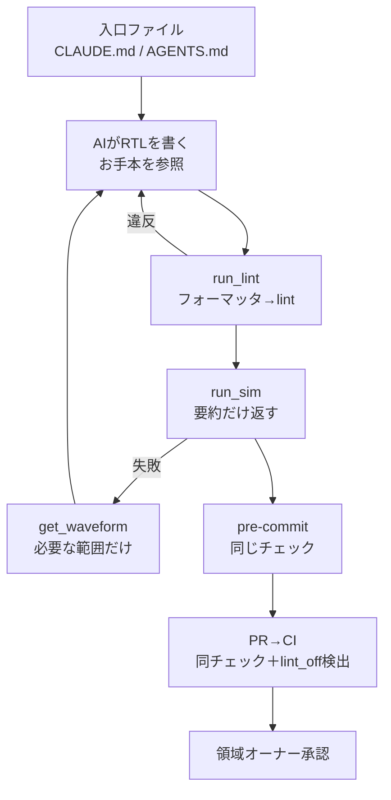
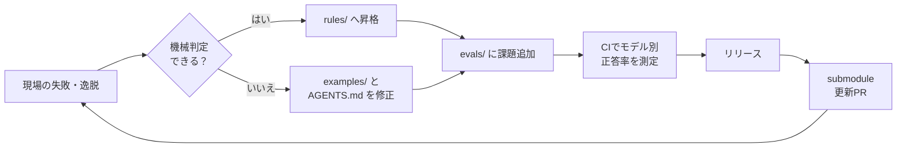

# RTL設計ハーネス サンプル実装プラン

Sep 24, 2026 · @TAK

## 目的とゴール

サンプル実装のゴールは、BUS・プロセッサ・検証の3領域で「AIが書いたRTLが、同じ規約とスタイルで、同じ検証を通る」状態を、1本のリポジトリで再現することです。

このハーネスは、「エージェント＝モデル＋ハーネス」のうちハーネス部分（指示・道具・検証・監視）を共通化します。共通化の対象は、Claude・GPT（Codex）・Qwen・GitHub Copilot の4系統です。

1. **均一化**：フォーマッタ・lint・お手本RTLで、書き手（人・各LLM）によらず書式・規約・設計スタイルを揃える
2. **共通基盤**：ルールとツールを1つだけ持ち、ツールごとの違いは生成される入口ファイルに閉じ込める
3. **複数人メンテ**：領域ごとのオーナーと CODEOWNERS で承認を分担する
4. **継続更新**：evals でモデル別の正答率を測り、変更が改善か劣化かを数値で判定する

## スコープ

サンプル実装は、ハーネスの仕組みが一周回る最小構成に絞ります。合成や大規模検証は、仕組みが回ったあとの拡張として扱います。

| 区分 | 内容 |
| --- | --- |
| 含む | rtl-harness リポジトリ一式、CODEOWNERS、CI |
| 含む | 3領域のお手本RTL（各領域2本）と領域規則 |
| 含む | MCPサーバ1つ（4ツール：run\_lint / run\_sim / get\_waveform / list\_design） |
| 含む | 同期スクリプト（Claude Code / Copilot / Codex / Qwen Code の入口生成） |
| 含む | evals 課題（領域ごとに3題、計9題）とモデル別基準値 |
| 含む | submodule で取り込むサンプル設計プロジェクト1本と、利用者5人程度のパイロット |
| 含まない | Vivado の合成・タイミング解析（ライセンスと実行時間のため） |
| 含まない | UVM による検証環境 |
| 含まない | RTLKit 本体の実装（JSON形式の約束と Python 簡易版のみ作る） |
| 含まない | 利用者30人全員への展開（パイロット完了後に判断） |

## 体制

体制は、領域オーナー6人（3領域×2人）、リリース担当1人、利用者30人の計37人です。領域オーナーを各領域2人にするのは、1人が不在でも承認が止まらず、オーナー同士でレビューできるからです。

| 役割 | 人数 | 担当範囲 | 主な仕事 |
| --- | --- | --- | --- |
| BUS 領域オーナー | 2 | examples/bus, rules/bus, evals/bus | AXI4-Lite・valid/ready のお手本と規則 |
| プロセッサ領域オーナー | 2 | examples/cpu, rules/cpu, evals/cpu | パイプライン・ハザード処理のお手本と規則 |
| 検証領域オーナー | 2 | tb/, mcp/, evals/ の枠組み, CI | テストハーネスの実体、MCPツール、評価基盤 |
| リリース担当 | 1 | AGENTS.md 共通部, rules/common, 同期スクリプト | リリース、2段階導入の管理、月次棚卸しの進行 |
| 利用者 | 30 | 各設計プロジェクト | 失敗・逸脱の Issue 報告、evals 課題の追加 |

承認ルールは次の2つです。

- 領域内の変更は、その領域のオーナー1人以上が承認する
- 共通部（AGENTS.md 共通部・rules/common）の変更は、リリース担当と、影響を受ける領域のオーナー1人が承認する

## 全体設計

全体設計の要点は「中身は1つ、ツールごとの違いは入口だけ」です。この要点を、1回の作業の流れと、ハーネスが育つ輪の2つで示します。

### 1回の作業の流れ



AI のループ・pre-commit・CI の3か所は、同じ rules/ と tb/ を使うので、結果が必ず一致します。

### ハーネスが育つ輪



### 設計上の決定事項

- **ルールの2種類**：読ませるルールは AGENTS.md（規則1行・理由1行・お手本の場所）、強制するルールは rules/（lint）に置く
- **MCPサーバは1つ**：AI から見えるツールは4つに絞り、小型モデルでも選び間違えにくくする
- **段階的な結果返却**：run\_sim は要約だけを返し、詳細は get\_waveform で必要な信号・範囲だけ取得する
- **観測系は後から差し替え**：list\_design と get\_waveform は JSON 形式を先に固定し、当面は Python 簡易版、将来は RTLKit（CLI → PyO3）に差し替える
- **モデル追加の影響範囲**：同期スクリプトと evals の測定対象だけ。AGENTS.md・examples/・mcp/・tb/ は変更しない

## リポジトリ構成と CODEOWNERS

リポジトリは、部品（ルール・お手本・ツール・課題）ごとに分け、その下を領域ごとに分けます。この2段の分け方により、CODEOWNERS で「部品×領域」の単位で承認者を決められます。

```text
rtl-harness/
├─ AGENTS.md              読ませるルールの目次（共通部＋各領域への参照）
├─ docs/
│   ├─ bus.md / cpu.md / verification.md   領域ごとの読ませるルール
│   └─ tool-schema.md     MCPツールの JSON 形式（RTLKit との約束）
├─ examples/
│   ├─ bus/   axi4lite_regs.sv, skid_buffer.sv
│   ├─ cpu/   pipelined_alu.sv, hazard_unit.sv
│   └─ verif/ ハンドシェイク用 driver / monitor のお手本
├─ rules/
│   ├─ common/  フォーマッタ設定、共通 lint（リセット・命名・ラッチ禁止）
│   ├─ bus/     BUS 固有の独自チェック
│   └─ cpu/     プロセッサ固有の独自チェック
├─ mcp/         MCPサーバ（Python、4ツール）
├─ tb/          テストハーネスの実体（cocotb＋Verilator 共通部品）
├─ evals/
│   ├─ runner/  課題を各モデルに解かせて採点する仕組み
│   └─ bus/ cpu/ verif/  課題（仕様文・ポート定義・cocotb テスト）
├─ scripts/sync/   入口ファイル生成（ツールごとの違いはここだけ）
├─ .github/
│   ├─ workflows/     CI
│   └─ ISSUE_TEMPLATE/
└─ CODEOWNERS
```

CODEOWNERS は、後に書いた行ほど優先されます。そのため、共通の既定を先に書き、領域ごとの行を後に書きます。

```text
# 既定：リリース担当
*                     @org/harness-release

# 共通部：リリース担当＋全領域オーナー（うち1人の承認で可）
/AGENTS.md            @org/harness-release @org/owners-bus @org/owners-cpu @org/owners-verif
/rules/common/        @org/harness-release @org/owners-bus @org/owners-cpu @org/owners-verif

# 領域
/docs/bus.md          @org/owners-bus
/examples/bus/        @org/owners-bus
/rules/bus/           @org/owners-bus
/evals/bus/           @org/owners-bus
/docs/cpu.md          @org/owners-cpu
/examples/cpu/        @org/owners-cpu
/rules/cpu/           @org/owners-cpu
/evals/cpu/           @org/owners-cpu
/docs/verification.md @org/owners-verif
/examples/verif/      @org/owners-verif
/tb/                  @org/owners-verif
/mcp/                 @org/owners-verif
/evals/runner/        @org/owners-verif
/evals/verif/         @org/owners-verif
/.github/workflows/   @org/owners-verif @org/harness-release
```

リポジトリ側では、ブランチ保護で「CI 成功」と「CODEOWNERS の承認」をマージ条件にします。

## フェーズ別の実装計画

実装は7フェーズ、目安は計13週です。順番は「検証ループを先に通し、その上にお手本・入口・測定を積む」で、各フェーズは前のフェーズの成果物を使います。週数は専任でない前提の概算です。

| フェーズ | 期間（目安） | 内容 | 主担当 | 完了条件 |
| --- | --- | --- | --- | --- |
| P0 基盤準備 | 1週 | リポジトリ作成、CODEOWNERS、ブランチ保護、ツール版の固定（Verilator・Verible・cocotb・Python）、実行環境のコンテナ化 | リリース担当 | 空の CI が PR ごとに走り、承認なしではマージできない |
| P1 最小検証ループ | 2週 | rules/common、tb/ 共通部品、mcp/ の run\_lint と run\_sim、pre-commit | 検証 | 手書きRTL1本で、CLI・MCP・CI の3入口が同じ結果を返す |
| P2 お手本と領域規則 | 2週 | 各領域の examples/ 2本、docs/ の領域ルール、rules/bus・rules/cpu の初期規則、AGENTS.md 目次 | 各領域 | お手本が全チェックを通り、AGENTS.md が100行以内 |
| P3 共通基盤化 | 1週 | scripts/sync（Claude Code・Copilot・Codex・Qwen Code）、サンプル設計プロジェクトへの submodule 取込み | リリース担当 | 4ツールすべてから run\_lint を呼べる |
| P4 evals | 2週 | evals/runner、領域ごとに3題（計9題）、nightly CI | 検証＋各領域 | 全モデルの初回正答率とスタイル違反率が基準値として記録される |
| P5 観測ツール | 1週 | get\_waveform と list\_design を Python 簡易版で実装、docs/tool-schema.md で JSON 形式を固定 | 検証 | 失敗時に AI が必要範囲だけ取得して修正できる |
| P6 パイロット運用 | 4週 | 利用者5人程度で試行、Issue テンプレート運用、月次棚卸し1回、2段階導入のリハーサル1回 | リリース担当 | v1.0 をリリースし、30人展開の可否を判断する |

### お手本 RTL と evals 課題の初期案

お手本は「その領域で一番揃えたい書き方」を含む小さなモジュールにします。evals 課題は、お手本と同じ書き方を要求する別の題にし、お手本の丸写しでは解けないようにします。

| 領域 | お手本（examples/） | evals 課題（3題） |
| --- | --- | --- |
| BUS | AXI4-Lite レジスタスレーブ、スキッドバッファ | 同期FIFO、valid/ready の2入力アービタ、AXI4-Lite 割込みレジスタ |
| プロセッサ | 3段パイプラインALU、ハザード検出ユニット | フォワーディング付きレジスタファイル、分岐判定とフラッシュ、ストール付き乗算器 |
| 検証 | valid/ready 用 driver・monitor、スコアボード | 既存RTLへのテスト追加、バグ入りRTLの原因特定、アサーション追加 |

## 運用ルール

運用は、Issue → PR → CI → オーナー承認の日常の流れと、月次の棚卸しの2つで回します。利用者30人の報告を滞らせないために、Issue は最初から領域ラベルで担当オーナーに振り分けます。

### Issue テンプレート

| テンプレート | 記入すること | 行き先 |
| --- | --- | --- |
| AI の失敗・逸脱 | モデル名、領域、入力した指示、出力されたRTL、期待した書き方 | 昇格判断 → rules/ か examples/、並行して evals/ 課題化 |
| ルール提案 | 規則案、理由、機械判定できるか、既存RTLへの影響 | 領域オーナーが検討し、月次棚卸しで決定 |
| ツール不具合 | ツール名、入力、返ってきた JSON、ハーネスのバージョン | 検証領域オーナー |

### PR の判定基準

| 変更の種類 | 触る場所 | 承認者 | 判定基準 |
| --- | --- | --- | --- |
| 強制ルールの追加 | rules/ ＋ AGENTS.md または docs/ の1行 | 領域オーナー（共通部はリリース担当も） | 既存 examples/ が通ること、既存プロジェクトでの違反件数を PR に記載 |
| 設計スタイルの修正 | examples/ ＋ docs/ | 領域オーナー | お手本自体がフォーマッタ・lint・シミュを通ること |
| ツールの改修 | mcp/ ・ tb/ | 検証領域オーナー | evals のモデル別正答率が前回から下がらないこと |
| モデルの追加 | scripts/sync ＋ evals の設定 | リリース担当 | そのモデルの初回正答率を基準値として記録すること |
| 課題の追加 | evals/<領域>/ | 領域オーナー（起票は利用者誰でも可） | 課題の正解RTLがシミュを通ること |

すべての PR で、CI は lint 無効化コメント（`lint_off` など）の追加を検出します。検出された PR は、該当領域オーナーの明示承認がないとマージできません。

### バージョンと強制ルールの2段階導入

バージョンはセマンティックバージョニングで切り、各プロジェクトは submodule でバージョンを固定します。固定しているので、強制ルールは次の2段階で導入できます。

1. **警告として導入**：マイナー版（例：1.3 → 1.4）。lint は報告するが CI は落とさない
2. **エラーへ格上げ**：次のメジャー版（例：2.0）。各プロジェクトは Renovate の submodule 更新 PR を受けた時点で対応する

### 月次の棚卸し

月次の棚卸しは、リリース担当が進行し、領域オーナー6人が出席します。議題は次の4つに固定します。

- 溜まった「AI の失敗・逸脱」のうち、lint へ昇格できるものの選定
- ルール提案の採否
- evals のモデル別正答率・スタイル違反率の推移
- 警告段階のルールを次のメジャー版でエラーにするかの判断

## リスクと対策

最大のリスクは、強制ルールの追加で既存プロジェクトが一斉に CI で落ちることです。このリスクは2段階導入で抑え、残りは次の表の対策で扱います。

| リスク | 影響 | 対策 |
| --- | --- | --- |
| 強制ルール追加で既存プロジェクトが一斉に失敗 | 利用者の反発、更新の停滞 | 警告→エラーの2段階導入、PR に影響件数を記載 |
| AI が lint 無効化コメントで逃げる | 均一化の崩れ | CI で検出し、領域オーナーの承認を必須にする |
| 各ツールの入口ファイル名・MCP 設定先の仕様変更 | ルールやツールが読まれなくなる | 違いを scripts/sync に集約し、CI で生成物を検証 |
| 小型ローカルモデルのコンテキスト不足・ツール誤選択 | Qwen の正答率低迷 | ツールを4つに限定、結果は要約で返す、AGENTS.md は100行以内、モデル別基準値 |
| LLM 出力の揺らぎ | evals の誤判定 | 各課題を複数回試行し平均を取る、許容幅を設ける |
| 利用者30人の Issue が特定オーナーに集中 | 対応の滞留 | 領域ラベルで振り分け、各領域2人体制、月次棚卸しで整理 |
| 利用者ごとの実行環境差（Windows / Linux） | シミュ結果の不一致 | シミュレータをコンテナまたは WSL2 に統一し、版を固定 |

## 未決事項

次の項目は、該当フェーズの開始前に決めます。

- [ ] 共通部（AGENTS.md 共通部・rules/common）の最終決定者を、リリース担当単独にするか合議にするか（P0 まで）
- [ ] 共通規則と領域規則の初期の中身（命名・リセット方式・FSM 形式など、各領域が起草、P2 まで）
- [ ] evals の許容幅（何ポイント低下で不合格か）と、課題あたりの試行回数（P4 まで）
- [ ] CI の実行環境（GitHub ホストかセルフホストか、ローカル Qwen を CI でどう動かすか）（P4 まで）
- [ ] 各ツールの入口ファイル名と MCP 設定先の最新仕様の確認（P3 まで）
- [ ] evals で使う API モデルの費用上限（P4 まで）
- [ ] 観測ツールを Python 簡易版から RTLKit へ切り替える時期
- [ ] パイロット利用者の選定（3領域から偏りなく5人程度、P6 まで）
